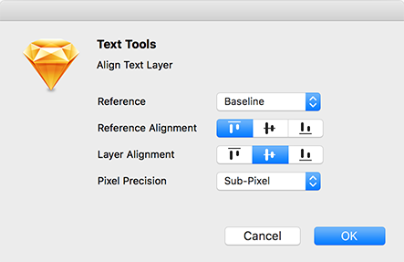
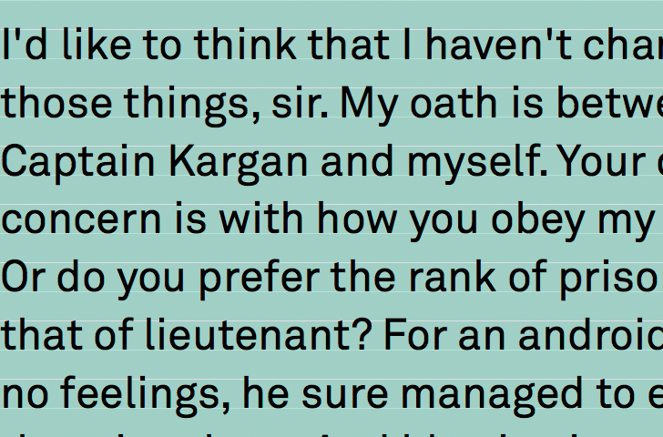
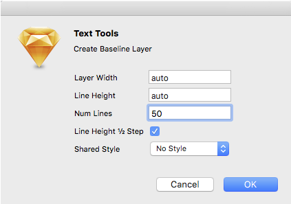

D R A F T

#sketch-text-tools

This plugin eases working with typography in Sketch. It enables displaying font metrics, aligning text-layers to text-layers or other layers relative to baseline, x-height and cap-height. Baseline grid reference layers can be extracted from text-layers or build with custom configurations. Text-layers can be split into several columns with specific gutter widths.

##Create Font Metrics

Extracts font metrics from text layer fonts. Creates a reference layer displaying the fonts baseline, ascent, descent, x-height and cap-height as well as the default line-height relative to the font-size used ( *blue* ). Furthermore the x-height and cap-height center get displayed ( *red* ). Metrics get extracted for the first line of a text layer. width equals text-layer width.

##Align Text

Aligns selected text-layers and non-text-layers. Alignment is based on a metric reference, e.g. centering all layers on a shared baseline or aligning all layers at the x-height top.

Option       | Description
------------ | -------------
Reference | The reference metric to be used. (Baseline,X-Height,Cap-Height)
Reference Alignment | Alignment to the reference. (e.g. to x-height center or top)
Layer Alignment | Alignment of text-layers and non-text-layers
Pixel Precision | Precision of resulting layer y position px

##Create Baseline

Creates a baseline reference layer either from text-layers or from configuration.

Option       | Description
------------ | -------------
Layer Width | The width of the baseline layer ('auto' on text-layers sets width to text-layer width)
Line Height | The line height  ('auto' on text-layers sets line-height to text-layer line-height )
Num Lines | The number of lines to display ('auto' on text-layers sets number of lines relative to text-layer height)
½ Step | If enabled an additional guide displaying half the line-height will be added

##Columnize

Splits a text-layer into multiple columns. Number of columns, gutter width and column height can be specified.

***Sorry, no hyphenation at the moment.***
