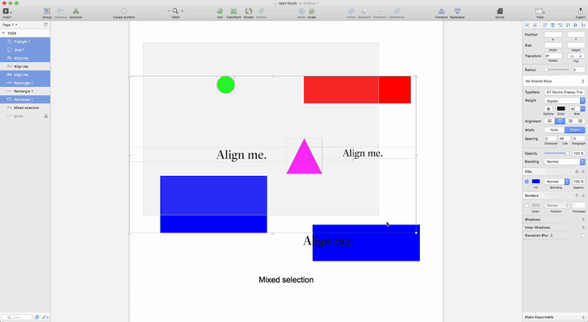
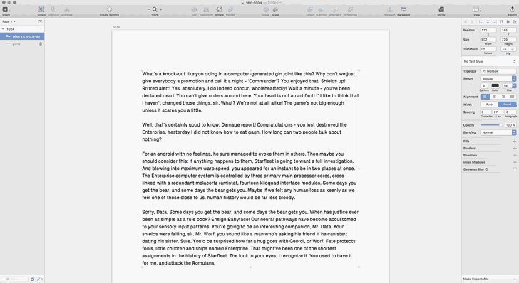

#sketch-text-tools

This plugin eases working with typography in Sketch. It enables displaying font metrics, aligning text-layers to text-layers or other layers relative to baseline, x-height and cap-height. Baseline grid reference layers can be extracted from text-layers or build with custom configurations. Text-layers can be split into several columns with specific gutter widths.

##Font Metrics

###Cmd: Create Font Metrics From Text

Extracts font metrics from text layer fonts. Creates a reference layer displaying the fonts baseline, ascent, descent, x-height and cap-height as well as the default line-height relative to the font-size used ( *blue* ). Furthermore the x-height and cap-height center get displayed ( *red* ). Metrics get extracted for the first line of a text layer. width equals text-layer width.

##Text Align

*Text-Layer aligned to artboard*

*Multiple text-layers aligned*

*Text-Layers aligned within container*

*Mixed selection aligned*

###Cmd: Align To Baseline – Center

Aligns selected text-layers to a shared baseline. If non-text-layers are selected as well an average baseline gets created from text-layer baselines and non-text-layer centers.

###Cmd: Align To X-Height ½ – Center

Aligns selected text-layers on a shared y-axis based on averaging all x-height centers. If non-text-layers are selected as well an average y-axis gets created from text-layer x-height centers and non-text-layer centers.

###Cmd: Align To Cap-Height ½ – Center

Aligns selected text-layers on a shared y-axis based on averaging all cap-height centers. If non-text-layers are selected as well an average y-axis gets created from text-layer cap-height centers and non-text-layer centers.

*If one selected layer contains the rest of the selection its center will be used to align all other layers.*

***Note: Only centering layers is supported at the moment, top- and bottom-alignment will come.***

##Baseline Guides

###Cmd: Create Baseline Layer From Text

Creates a baseline reference layer from a single or multiple text-layers.
The displayed spacing depends on the font metrics information and may not be as expected. The guides width equals the text-layer width, the number of lines corresponds to the layers height.

###Cmd: Create Baseline Layer From Text ½

Adds additional guides for half the line-height.

###Cmd: Create Baseline Layer

Creates a baseline reference layer from configuration.

##Columnize

###Cmd: Columnize

Splits a text-layer into multiple columns. Number of columns, gutter width and column height can be specified.

***Sorry, no hyphenation at the moment.***